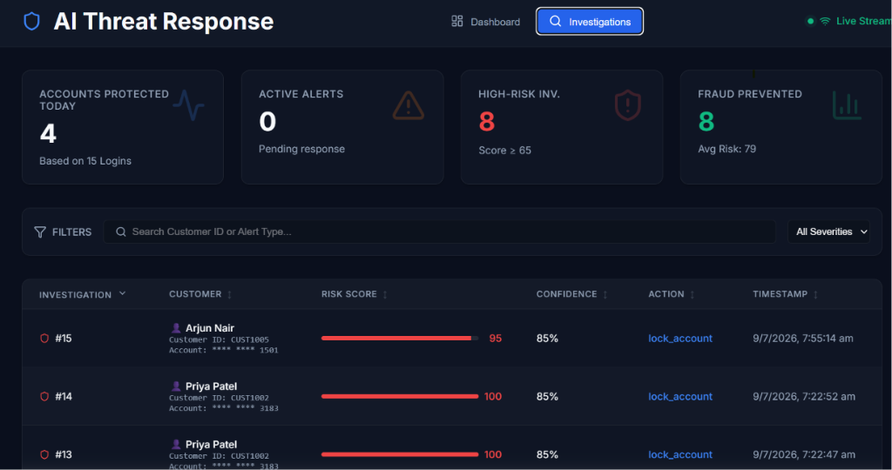
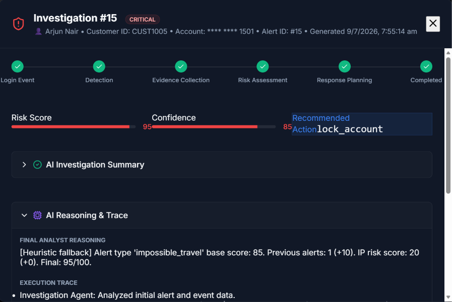
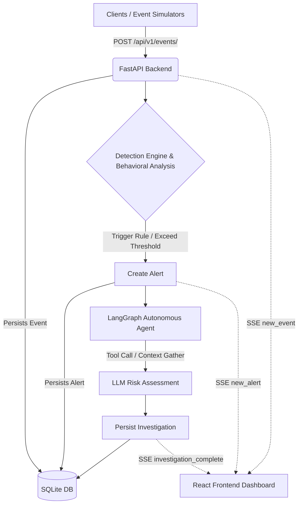
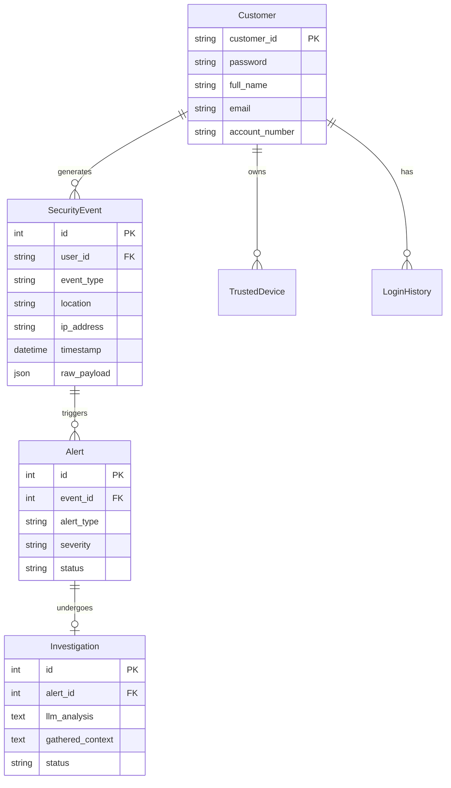

# AI Cyber Threat Investigation & Response Platform




This is a comprehensive, AI-powered platform for detecting, analyzing, and responding to cyber threats (e.g., suspicious banking logins) in real-time. It features a FastAPI backend, a LangGraph-powered LLM autonomous investigation agent, and a React-based real-time dashboard.

## Architecture & Data Flow



## Database Architecture



## Features
- **Security Event Ingestion**: Robust endpoints to log authentication attempts, IP metadata, and user actions.
- **Behavioral Analysis Engine**: Evaluates real-time logins against historical patterns to flag impossible travel, unknown devices, and unusual login times.
- **Brute-Force & High-Risk Detection**: Instantly flags high-risk demo locations and blocks brute-force attempts after a configured limit.
- **LLM-Powered Investigation**: Uses `LangGraph` and OpenAI to autonomously collect historical evidence (IP reputation, past alerts) and evaluate fraud risk with human-like analytical reasoning.
- **Real-Time Streaming**: Server-Sent Events (SSE) stream login data, alerts, and completed investigation records directly to the dashboard in real time.
- **Frontend Dashboard**: A premium, responsive React interface built with Vite, styled with glassmorphism to monitor threats at a glance.

---

## Getting Started

### 1. Backend Setup

Ensure you have Python 3.11+ installed.

```bash
cd backend
python -m venv venv
# Windows: venv\Scripts\activate
# macOS/Linux: source venv/bin/activate
pip install -r requirements.txt
```

Set your API Key for the Autonomous Investigation Agent by creating a `.env` file in the `backend` directory:
```
OPENAI_API_KEY=your_openai_api_key_here
```
*(If no key is provided, the platform automatically falls back to heuristic-based risk evaluation without crashing).*

**Run the backend server:**
```bash
uvicorn app.main:app --reload
```
The server runs on `http://127.0.0.1:8000`.

### 2. Frontend Setup

Ensure you have Node.js 18+ installed.

```bash
cd frontend
npm install
npm run dev
```
The dashboard will run on `http://localhost:5173`.

---

## Simulating Traffic

The platform includes a built-in event simulator to generate realistic traffic flows. With both backend and frontend running, open a new terminal:

```bash
cd backend
python -m app.simulators.event_generator --scenario all
```

**Available Scenarios:**
- `normal_activity`: Legitimate login/logout sequence.
- `impossible_travel`: London and Tokyo logins 5 minutes apart.
- `brute_force`: Multiple failed logins followed by a success.
- `new_device`: Successful login from an unrecognized device.

Watch the React dashboard populate in real time!

---

## Running Tests

The test suite thoroughly verifies the REST API, the detection heuristics, and the LLM fallback logic using an isolated in-memory SQLite database.

```bash
cd backend
$env:PYTHONPATH="."  # For Windows
# export PYTHONPATH="."  # For Linux/Mac
python -m pytest tests/ -v
```
